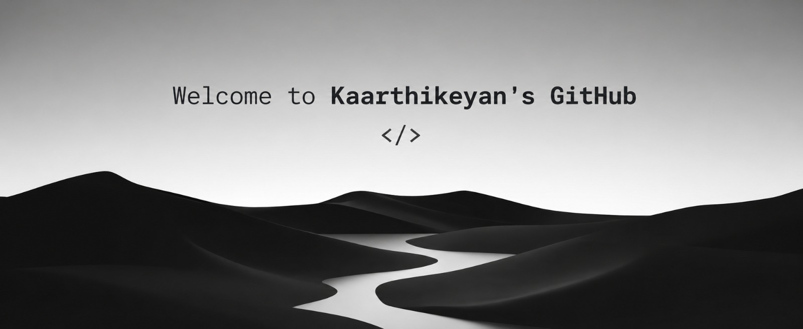

  

<h3 align="center" >
💻 Computer Science Student | Aspiring Full Stack Developer | Python & SQL Enthusiast | Passionate About Building Modern Web Applications 🚀
</h3>
<h1></h1>

## 🚀 About Me

- 🎓 Computer Science Graduate
- 💻 Passionate about building modern and responsive web applications
- 🌱 Currently learning **Data Structure and Algorithm**
- 🔭 I’m currently working on **Result Management**
- 🚀 Love solving real-world problems through code
- 📫 Reach me at: **kaarthikeyanm120105@gmail.com**
- ⚡ Fun Fact: I enjoy turning ideas into interactive web experiences.

  

<h3 align="left">Connect with me:</h3>

## 🧰 Languages & Tools I Have Placed My Hands On

  

   

---

## 💻 Tech Stack

  
  
  
  
 

   
  
  
  
  
  
  
  
  
  

  

